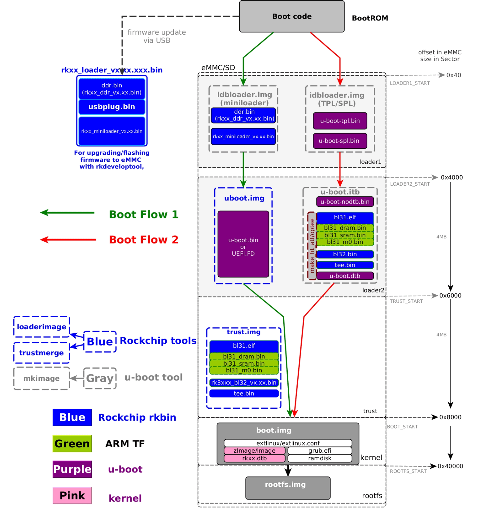

# TN3399_V3

> 镜像下载：https://github.com/lanseyujie/tn3399_v3/releases

## 规格参数

|   部件名称    |       芯片型号       |                           备注说明                           |
| :-----------: | :------------------: | :----------------------------------------------------------: |
|      CPU      |        RK3399        | Dual-core Cortex-A72 up to 1.8GHz;Quad-core Cortex-A53 up to 1.4GHz;Mali-T864 GPU |
|      RAM      |       K4B8G16        |                  Dual-channel DDR3 1GB * 4                   |
|     Flash     | SanDisk SDINBDG4-16G |                           eMMC 5.1                           |
|      PMU      |        RK808D        |                                                              |
|   Ethernet    |       RTL8211E       |                      10/100/1000 Base-T                      |
|    WIFI+BT    |        AP6255        |               WIFI IEEE802.11 a/b/g/n/ac;BT4.2               |
|   SATA 3.0    |        JMS578        |                                                              |
|    USB 2.0    |        FE1.1s        |     TYPE A Mount Socket * 2 & 4-Pin Connector Socket * 5     |
|    USB 3.0    |       VL817-Q7       |                   TYPE A Mount Socket * 2                    |
|     UART      |      SP3232EEN       |                                                              |
| HDMI 2.0+LVDS |  358775G + ALC5640   |                                                              |
|   Audio PA    |        NS4258        |                            5W * 2                            |

## 启动流程[^1]



## 固件编译

### 编译环境

```shell
# 拉取镜像
docker pull ubuntu:20.04
# 启动容器
docker run -it --name builder -v $HOME/build/:/data/ ubuntu:20.04 bash

# 更换软件源
cp -a /etc/apt/sources.list /etc/apt/sources.list.bak
sed -i "s@http://.*archive.ubuntu.com@http://mirrors.huaweicloud.com@g" /etc/apt/sources.list
sed -i "s@http://.*security.ubuntu.com@http://mirrors.huaweicloud.com@g" /etc/apt/sources.list

# 更新软件包
apt update && apt upgrade -y

# 进入工作目录
cd /data/
```

### 工具链

```shell
# arm64 工具链
# 主页：https://www.linaro.org/downloads/
wget -c https://releases.linaro.org/components/toolchain/binaries/latest-7/aarch64-linux-gnu/gcc-linaro-7.5.0-2019.12-x86_64_aarch64-linux-gnu.tar.xz
# 或者使用镜像
wget -c https://mirrors.tuna.tsinghua.edu.cn/armbian-releases/_toolchains/gcc-linaro-7.4.1-2019.02-x86_64_aarch64-linux-gnu.tar.xz

# 解压工具链
mkdir toolchain
tar xvJf gcc-linaro-*-x86_64_aarch64-linux-gnu.tar.xz -C ./toolchain --strip-components=1

# arm 裸机工具链，主要用于编译 ATF
apt install -y gcc-arm-none-eabi
# 或者自行下载并配置
# 主页：https://developer.arm.com/tools-and-software/open-source-software/developer-tools/gnu-toolchain/gnu-rm/downloads
wget -c https://armkeil.blob.core.windows.net/developer/Files/downloads/gnu-rm/9-2020q2/gcc-arm-none-eabi-9-2020-q2-update-x86_64-linux.tar.bz2

# 配置环境变量
export PATH=/data/toolchain/bin:$PATH
# 测试
aarch64-linux-gnu-gcc -v
arm-none-eabi-gcc -v

# 安装辅助工具
apt install -y build-essential libncurses5-dev git make
```

### u-boot

#### 设备树

```shell
# 设备树的编译与反编译
apt install -y device-tree-compiler

# dtb => dts
dtc -I dtb -O dts -o tn3399-linux.dts tn3399-linux.dtb
# dts => dtb
dtc -I dts -O dtb -o tn3399-linux.dtb tn3399-linux.dts
```

#### 编译

##### 原版 u-boot[^2][^3]

```shell
# ATF
git clone https://github.com/ARM-software/arm-trusted-firmware.git
cd arm-trusted-firmware

# 编译 ATF
unset BL31
make CROSS_COMPILE=aarch64-linux-gnu- PLAT=rk3399
# 得到 build/rk3399/release/bl31/bl31.elf
export BL31=/data/arm-trusted-firmware/build/rk3399/release/bl31/bl31.elf

apt install -y bison flex python3 device-tree-compiler bc
git clone https://github.com/u-boot/u-boot.git
cd u-boot

# 修改设备树
cat ../tn3399_v3/config/tn3399-linux.dts > ./arch/arm/dts/rk3399-rock960.dts

# 清理工程
make distclean
# 生成 .config 配置文件
make rock960-rk3399_defconfig
# 或者自定义配置
make menuconfig

# 编译 u-boot
export CROSS_COMPILE=aarch64-linux-gnu-
make -j$(nproc)
# 得到 idbloader.img 和 u-boot.itb
# idbloader.img 是 TPL 和 SPL 的合成文件，前者负责 DDR 初始化，后者负责加载 ATF 和 u-boot
# u-boot.itb 是由 u-boot 和 ATF 合成的 FIT 格式的镜像文件

# 生成 rk3399_loader_v1.xx.xxx.bin
git clone https://github.com/rockchip-linux/rkbin.git
cd rkbin
./tools/boot_merger ./RKBOOT/RK3399MINIALL.ini .
```

##### RockChip 维护的 u-boot[^4]

```shell
# 用于合并 loader 的工具集
git clone https://github.com/rockchip-linux/rkbin.git

apt install -y bison flex python3 device-tree-compiler bc
git clone -b stable-4.4-rk3399-linux https://github.com/rockchip-linux/u-boot.git
cd u-boot

# 不使用项目指定的工具链
sed -i 's@TOOLCHAIN_ARM32=.*@TOOLCHAIN_ARM32=/@g' ./make.sh
sed -i 's@TOOLCHAIN_ARM64=.*@TOOLCHAIN_ARM64=/@g' ./make.sh
sed -i 's@${absolute_path}/bin/@@g' ./make.sh

# 编译修改过的 u-boot
./make.sh evb-rk3399
# 得到如下文件
rk3399_loader_v1.24.126.bin
trust.img
uboot.img

# 合成 idbloader.img 文件
../rkbin/tools/mkimage -n rk3399 -T rksd -d ../rkbin/bin/rk33/rk3399_ddr_800MHz_v1.24.bin idbloader.img
cat ../rkbin/bin/rk33/rk3399_miniloader_v1.26.bin >> idbloader.img

# 也可以从此项目编译原版 u-boot
```

### kernel

#### 原版 kernel

> 此仓库约占用 3 GB，编译后约占用 8 GB，请至少留有 10 GB 硬盘空间，编译大约需要 40 分钟。

```shell
apt install -y libssl-dev lzop kmod
git clone https://git.kernel.org/pub/scm/linux/kernel/git/stable/linux.git

# 或从镜像快速克隆
git clone https://mirrors.tuna.tsinghua.edu.cn/git/linux.git
cd linux
git remote add upstream https://git.kernel.org/pub/scm/linux/kernel/git/stable/linux.git
git fetch upstream

# 切换内核版本
git checkout linux-5.8.y

# 防止版本号后出现 -dirty 等后缀
touch .scmversion

# 修改设备树
cat ../tn3399_v3/config/tn3399-linux.dts > ./arch/arm64/boot/dts/rockchip/rk3399-rock960.dts
sed -i 's/bcm4329-fmac/bcm43455-fmac/g' ./arch/arm64/boot/dts/rockchip/rk3399-rock960.dtsi

# 清理工程
make distclean
# 生成 .config 配置文件
make defconfig
# 或者自定义配置
make menuconfig
make savedefconfig

# 编译 kernel
export ARCH=arm64
export CROSS_COMPILE=aarch64-linux-gnu-
make -j$(nproc)
# 得到如下文件
arch/arm64/boot/dts/rockchip/rk3399-rock960.dtb
arch/arm64/boot/Image
```

#### RockChip 维护的 kernel[^5]

```shell
# TODO
```

### rootfs

```shell
# 使用 custom_rootfs.sh 定制 rootfs
./scripts/build_rootfs.sh custom
```

### 镜像制作

#### 打包

```shell
# 按如下目录结构整理编译所得的文件
mkdir -p ./out/{kernel,u-boot}
./out/
├── kernel
│   ├── Image
│   └── tn3399-linux.dtb
├── rootfs
│   └── ...
└── u-boot
    ├── idbloader.img
    ├── trust.img (仅使用 uboot.img 时使用，详见启动流程一节)
    └── u-boot.img / u-boot.itb

# 生成 boot.img
./scripts/build_image.sh boot

# 生成 rootfs.img
./scripts/build_image.sh rootfs

# 生成 system.img
./scripts/build_image.sh system
```

#### 修改

```shell
# -f 查找第一个未使用的设备
# -P 创建带分区的回环设备
sudo losetup -f --show -P system.img

# 查看镜像的分区信息
fdisk -l system.img

# 挂载分区 3
sudo mount /dev/loop0p3 /mnt/
# 另一种方法，$begin 为分区 3 的起点
sudo mount -o loop,offset=$((512 * $begin)) system.img /mnt/

# 在此执行自定义修改命令

# 卸载分区
# 注意：卸载时 shell 不可以处于 /mnt/ 下，否则报错 umount: /mnt: target is busy.
sudo umount /mnt/

# 断开回环设备
sudo losetup -d /dev/loop0

# 断开所有回环设备
sudo losetup -D
```

## 烧写调试

### 出厂固件[^6]

#### 备份

```shell
# 查看 cmdline
# 将 cmdline 记录在 parameter_gpt.txt 中
adb shell
su
cat /proc/cmdline

# 查看分区表
./rkbin/tools/upgrade_tool pl
# 或
rkdeveloptool ppt

# 备份分区
# 备份文件保存在 ./out/backup 路径下
./scripts/factory_image.sh backup
```

#### 恢复

```shell
# 恢复分区
# 从 ./out/backup 路径读取备份进行恢复
# 警告：尚未完成测试
./scripts/factory_image.sh restore ./rk3399_loader_v1.22.119.bin
```

### 固件烧写

#### eMMC

> 相关工具：https://github.com/rockchip-linux/rkbin

1. 创建 udev 规则

    可以避免无 sudo 权限时不能发送指令或烧写报错 “Creating Comm Object failed!”。

    ```shell
    echo 'SUBSYSTEM=="usb", ATTR{idVendor}=="2207", MODE="0660", GROUP="plugdev"' | sudo tee -a /etc/udev/rules.d/51-android.rules
    ```

2. 进入烧写模式

    连接 Micro-USB，长按 RECOVER 键并上电，如果为 Android 系统此时应为 Loader 模式，其他系统可能为 MaskRom 模式。

    ```shell
    # 查看连接的设备
    ./rkbin/tools/upgrade_tool ld
    # 或使用 rkdeveloptool
    # 因 ./rkbin/tools/rkdeveloptool 这个不支持 ld 命令故需要重新编译 rkdeveloptool
    git clone https://github.com/rockchip-linux/rkdeveloptool.git
    sudo apt install -y libudev-dev libusb-dev dh-autoreconf libglib2.0-dev
    cd rkdeveloptool && autoreconf -i && ./configure && make
    sudo mv rkdeveloptool /usr/local/bin/
    rkdeveloptool ld

    # 应会有如下设备信息
    DevNo=1 Vid=0x2207,Pid=0x330c,LocationID=301    Loader
    # 或
    DevNo=1 Vid=0x2207,Pid=0x330c,LocationID=301    MaskRom

    # Loader 模式进入 MaskRom 模式方法
    ./rkbin/tools/upgrade_tool rd 3
    # 或
    rkdeveloptool rd 3
    ```

3. 初始化 DRAM

    需要在 MaskRom 模式下才下载，否则报错 “The device does not support this operation!”。

    ```shell
    # 初始化 DRAM
    ./rkbin/tools/upgrade_tool db ./rk3399_loader_v1.22.119.bin
    # 或
    rkdeveloptool db ./rk3399_loader_v1.22.119.bin

    # 下载镜像
    ./rkbin/tools/upgrade_tool wl 0x0 ./system.img
    # 或
    rkdeveloptool wl 0x0 ./system.img
    ```

#### SDCard

> 也可以使用图形化烧写工具 balena-etcher-electron
>
> https://github.com/balena-io/etcher/releases

```shell
# sdX 为 sdcard 对应的块设备文件
sudo dd if=system.img of=/dev/sdX bs=4M oflag=sync status=progress
```

### 串口调试

#### 串口选择

测试了市面上常见的几款 CH340G、PL2303HX 方案的串口，均存在只能读不能写问题，这将无法从串口打断 u-boot 启动和进行 shell 操作，建议使用 CP2104 方案的串口代替。

#### 通信软件

> 也可以使用 minicom 、putty、SecureCRT 等工具。

```shell
# 解决串口权限问题
sudo usermod -a -G dialout $USER
# 重新登录后生效
reboot

# 安装串口通信软件
sudo apt install -y python3-serial

# 打开串口
miniterm /dev/ttyUSB0 1500000

# 退出 miniterm 快捷键为 Ctrl + ]
```

## 系统配置

### 网络

```shell
# WiFi 配置
nmcli dev wifi connect "hotspot-name" password "password"
# 或使用 nmtui 命令图形化修改
```

### 镜像源

```shell
sudo cp -a /etc/apt/sources.list /etc/apt/sources.list.bak
sudo sed -i "s@http://ports.ubuntu.com@http://mirrors.huaweicloud.com@g" /etc/apt/sources.list
```

### 本地化

```shell
# 安装英文与简体中文语言包
sudo apt install -y language-pack-en language-pack-zh-hans
# 设置本地化
sudo dpkg-reconfigure locales

# 配置时区
sudo apt install -y tzdata
sudo dpkg-reconfigure tzdata
# 同步硬件时间
sudo hwclock -s
```

### 分区扩容

```shell
sudo apt install -y parted
sudo parted /dev/mmcblk2
unit s
print
resizepart 5 100%
print
Q

sudo resize2fs /dev/mmcblk2p5
```

### Docker

```shell
sudo apt install gnupg2 -y

# 添加 apt 公钥
curl -fsSL https://download.docker.com/linux/debian/gpg | sudo apt-key add -

# 添加软件源
echo "deb [arch=arm64] https://download.docker.com/linux/ubuntu $(lsb_release -cs) stable" | sudo tee /etc/apt/sources.list.d/docker.list

# 安装 docker
sudo apt update && sudo apt install docker-ce -y

# 非 root 用户免 sudo 操作 docker
sudo usermod -aG docker $USER
```

## 常见问题

Q：能进 MaskRom 模式，但下载 Loader 初始化 DRAM 总是失败。或 u-boot 无等待时间不能按 RECOVERY 键进入 MaskRom 模式。

A：插上带有系统的 SDCard，默认会从 SDcard 启动，连接串口并打开串口调试软件，开机后迅速在调试窗口按任意键，打断 u-boot 启动（如果不能打断请更换 CP2104 方案的串口），执行如下命令破坏 u-boot，重启后会自动进入 MaskRom 模式。

```shell
mmc dev 0
mmc erase 0 2000
reset
```

---

Q：使用 apt 安装软件包时出现如下警告：

> perl: warning: Setting locale failed.
> perl: warning: Please check that your locale settings:
>        LANGUAGE = (unset),
>        LC_ALL = (unset),
>        LANG = "zh_CN.UTF-8"
>    are supported and installed on your system.
> perl: warning: Falling back to the standard locale ("C").

A：参考 系统配置-本地化 一节安装相应语言包即可解决。

---

Q：以太网卡因未被 network-manager 托管不能启用。

```shell
# 网卡未启用
ip addr show eth0
2: eth0: <BROADCAST,MULTICAST> mtu 1500 qdisc noop state DOWN group default qlen 1000
    link/ether 16:a6:4c:50:54:44 brd ff:ff:ff:ff:ff:ff

# 网卡未被 network-manager
nmcli device
DEVICE  TYPE      STATE      CONNECTION
eth0    ethernet  unmanaged  --
lo      loopback  unmanaged  --

# 使用该命令启用网卡无效
nmcli dev set eth0 managed yes
```

A：原因在于 network-manager 的默认配置 /usr/lib/NetworkManager/conf.d/10-globally-managed-devices.conf 不会托管以太网卡[^7]。解决方法如下：

```shell
# 使用 netplan 配置以太网络
sudo nano /etc/netplan/01-netcfg.yaml

# 配置为动态获取 IP
network:
  version: 2
  renderer: networkd
  ethernets:
    eth0:
      dhcp4: yes

# 或静态 IP
network:
  version: 2
  renderer: networkd
  ethernets:
    eth0:
     dhcp4: no
     addresses: [10.0.0.10/24]
     gateway4: 10.0.0.1
     nameservers:
       addresses: [223.5.5.5,223.6.6.6]

# 应用配置
sudo netplan --debug apply
```

也可以使用 network-manager 托管所有网络设备，尽管官方不推荐这样做。

```shell
# 覆盖默认配置
sudo touch /etc/NetworkManager/conf.d/10-globally-managed-devices.conf
```

---

Q：如何获取当前系统的设备树和内核编译选项？

A：使用如下命令获取：

```shell
# 设备树
cat /sys/firmware/fdt > raw.dtb

# 内核编译选项
zcat /proc/config.gz > kernel.config
```

---

Q：如何连接蓝牙音箱？

A：使用如下命令连接：

```shell
sudo apt install -y bluez bluez-tools pulseaudio pulseaudio-module-bluetooth

# 查看蓝牙信息
hciconfig

# 使用 bluetoothctl 命令操作蓝牙
# 上电
power on
# 扫描
scan on
# 配对
pair MAC
# 信任
trust MAC
# 连接
connect MAC

# 如果连接时出现 Failed to connect: org.bluez.Error.Failed 可以通过重启 pulseaudio 解决
pulseaudio -k
pulseaudio --start

# 声道测试
speaker-test -c2 -twav

# 查看 PulseAudio 信息
pactl info

# 查看音频输出通道
pactl list sinks

# 设置为默认音频输出通道，通过 TAB 补全后面的名称
pactl set-default-sink bluez_sink.MAC.a2dp_sink
```

## 参考资料

[^1]: [Boot option - Rockchip open source Document](http://opensource.rock-chips.com/wiki_Boot_option)

[^2]: [U-Boot v2020.01 和 Linux 5.4 在 RK3399 上部署](https://aijishu.com/a/1060000000079034)

[^3]: [ATF - Rockchip open source Document](http://opensource.rock-chips.com/wiki_ATF)

[^4]: [U-Boot - Rockchip open source Document](http://opensource.rock-chips.com/wiki_U-Boot)

[^5]: [Rockchip Kernel - Rockchip open source Document](http://opensource.rock-chips.com/wiki_Rockchip_Kernel)

[^6]: [Rkdeveloptool - Rockchip open source Document](http://opensource.rock-chips.com/wiki_Rkdeveloptool)

[^7]: [network-manager does not manage ethernet and bluetooth interfaces](https://bugs.launchpad.net/ubuntu/+source/network-manager/+bug/1638842)

